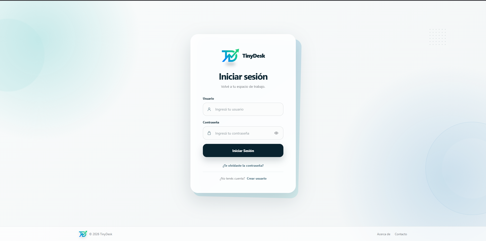
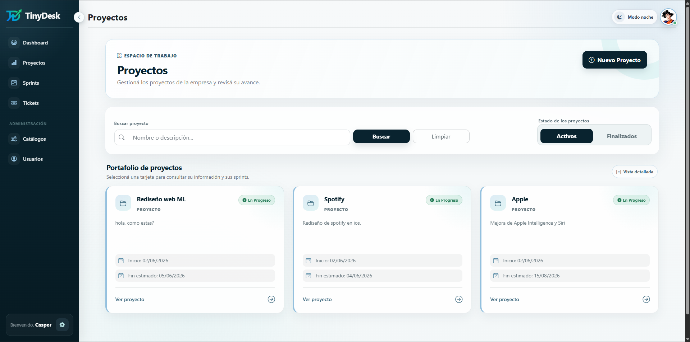
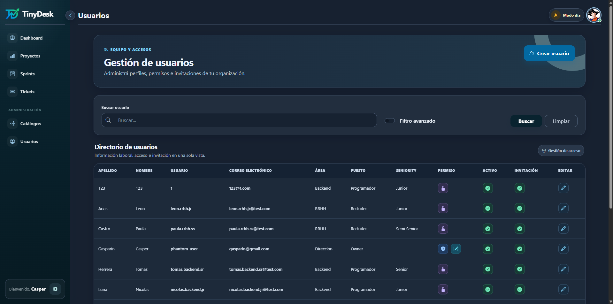
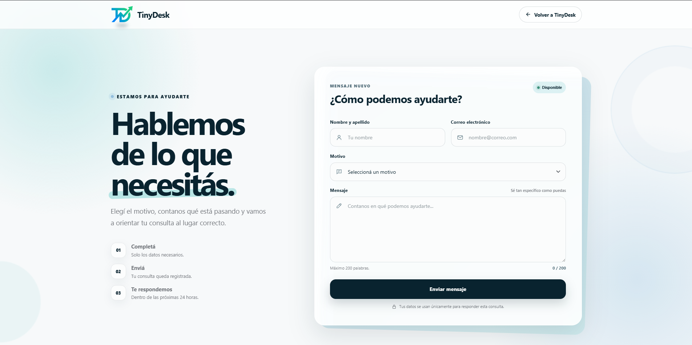

# 🖥️ TinyDesk Web

> Sistema de gestión de proyectos, sprints y tickets para equipos de desarrollo — construido con **ASP.NET Web Forms** y **SQL Server**.

---

## 📋 Tabla de contenidos

- [¿Qué es TinyDesk?](#-qué-es-tinydesk)
- [✨ Funcionalidades](#-funcionalidades)
- [🏗️ Arquitectura](#️-arquitectura)
- [🗄️ Base de datos](#️-base-de-datos)
- [🚀 Instalación y configuración](#-instalación-y-configuración)
- [📸 Capturas de pantalla](#-capturas-de-pantalla)
- [🧠 Motor de sugerencia IA](#-motor-de-sugerencia-ia)
- [📧 Notificaciones por email](#-notificaciones-por-email)
- [🛠️ Stack tecnológico](#️-stack-tecnológico)

---

## ❓ ¿Qué es TinyDesk?

**TinyDesk** es una aplicación web de gestión de proyectos ágiles pensada para empresas con múltiples equipos. Permite crear proyectos, organizarlos en sprints, asignar tickets a desarrolladores y hacer un seguimiento completo del trabajo — todo con control de roles, auditoría de cambios y notificaciones por email.

---

## ✨ Funcionalidades

### 👑 Panel de Administrador
| Módulo | Descripción |
|---|---|
| **Proyectos** | Crear, editar, activar/desactivar proyectos con fechas y estados |
| **Sprints** | Gestionar sprints por proyecto y área, con barra de progreso en tiempo y tickets |
| **Tickets** | Crear y asignar tickets a usuarios con prioridad, estado y fecha estimada |
| **Usuarios** | Alta, baja, configuración de permisos y seniority por área y puesto |
| **Estados** | Configurar estados personalizados por empresa (con flag de estado final) |
| **Puestos y Áreas** | Administración de estructura organizacional multi-empresa |
| **Auditoría** | Historial completo de cambios con usuario, campo, valor anterior/nuevo y descripción |

### 👤 Panel de Usuario
| Módulo | Descripción |
|---|---|
| **Mis proyectos** | Vista de todos los proyectos en los que participa el usuario |
| **Mis sprints** | Sprints activos con progreso visual |
| **Mis tickets** | Tickets asignados con filtros y cambio de estado |
| **Perfil** | Configuración personal, foto de perfil y cambio de contraseña |
| **Contacto** | Formulario para enviar mensajes por email |

### 🔐 Autenticación y seguridad
- Registro con **verificación de email** (token de un solo uso)
- **Recuperación de contraseña** por email con token con expiración
- Passwords hasheados con **SHA-256 + salt**
- Sistema de roles: **Admin** / **Usuario con permiso de escritura** / **Usuario de solo lectura**

---

## 🏗️ Arquitectura

El proyecto sigue una arquitectura de **3 capas** clásica:

```
TinyDeskWeb/
│
├── 📁 dominio/              # Capa de entidades (POCOs)
│   ├── Usuario.cs
│   ├── Proyecto.cs
│   ├── Sprint.cs
│   ├── Ticket.cs
│   ├── Auditoria.cs
│   └── ...
│
├── 📁 negocio/              # Capa de lógica de negocio + acceso a datos
│   ├── AccesoDatos.cs       # ADO.NET wrapper (SqlConnection, SqlCommand)
│   ├── UsuarioNegocio.cs
│   ├── ProyectoNegocio.cs
│   ├── SprintNegocio.cs
│   ├── TicketNegocio.cs
│   ├── AuditoriaNegocio.cs
│   ├── EmailService.cs      # SMTP con Mailtrap
│   ├── CandidatoAsignacionIANegocio.cs  # Motor de sugerencia IA
│   └── ...
│
└── 📁 TP Final Programacion III/   # Capa de presentación (Web Forms)
    ├── Site.Master          # Layout admin
    ├── UsuarioSite.Master   # Layout usuario
    ├── Default.aspx         # Dashboard admin
    ├── Proyectos.aspx
    ├── Sprints.aspx
    ├── Tickets.aspx
    ├── Usuarios.aspx
    ├── Administracion.aspx
    ├── Login.aspx / Registro.aspx
    └── ...
```

### Flujo de datos

```
[.aspx / .aspx.cs]  ──►  [negocio/*.cs]  ──►  [AccesoDatos.cs]  ──►  [SQL Server]
   Presentación              Negocio              ADO.NET puro          TinyDesk_Web
```

> No se utiliza ningún ORM (Entity Framework, Dapper, etc.). Todo el acceso a datos es **ADO.NET puro** con `SqlConnection` y `SqlCommand`.

---

## 🗄️ Base de datos

La base de datos se llama `TinyDesk_Web` y corre sobre **SQL Server Express**. El script completo de creación está en [`TinyDesk_ASP.sql`](./TinyDesk_ASP.sql).

### Diagrama de entidades

```
EMPRESA
  │
  ├──► USUARIO (NombreUsuario, PasswordHash, Email, Activo, EsAdmin, PermisoEscritura...)
  │       ├── PUESTO  (Owner, Developer, QA, ...)
  │       ├── AREA    (Dirección, Backend, Frontend, ...)
  │       └── SENIORITY (Junior, Semi Senior, Senior, Lead)
  │
  ├──► PROYECTO (Nombre, Descripción, FechaInicio, FechaEstimadaFin, Estado)
  │       └──► SPRINT (NumeroSprint, FechaInicio, FechaEstimadaFin, Area, Estado)
  │               └──► TICKET (Descripcion, Prioridad, Estado, Usuario asignado)
  │
  ├──► ESTADO (Nombre, EsFinal, EsSistema)  ← estados globales y por empresa
  ├──► AUDITORIA (Entidad, Accion, CampoModificado, ValorAnterior, ValorNuevo)
  └──► USUARIO_TOKEN (Token, Tipo, FechaExpiracion, Usado)  ← para email/pass recovery
```

### Tablas principales

| Tabla | Descripción |
|---|---|
| `USUARIO` | Usuarios del sistema con roles y permisos |
| `PROYECTO` | Proyectos de la empresa |
| `SPRINT` | Iteraciones dentro de un proyecto |
| `TICKET` | Tareas individuales asignadas a un usuario |
| `ESTADO` | Estados configurables (globales y por empresa) |
| `AUDITORIA` | Log de todos los cambios del sistema |
| `USUARIO_TOKEN` | Tokens para validación de email y recuperación de contraseña |
| `SENIORITY` | Niveles de experiencia (Junior / Semi Senior / Senior / Lead) |

---

## 🚀 Instalación y configuración

### Requisitos previos

- [Visual Studio 2022](https://visualstudio.microsoft.com/) con soporte para ASP.NET Web Forms
- [SQL Server Express](https://www.microsoft.com/es-es/sql-server/sql-server-downloads) (o LocalDB)
- .NET Framework 4.x

### Pasos

**1. Clonar el repositorio**
```bash
git clone https://github.com/SebasYa/TinyDeskWeb.git
cd TinyDeskWeb
```

**2. Crear la base de datos**

Abrí SQL Server Management Studio y ejecutá el script `TinyDesk_ASP.sql`. Esto crea la base de datos, todas las tablas, índices, datos semilla y un usuario de prueba.

**3. Verificar la cadena de conexión**

En `negocio/AccesoDatos.cs` asegurate de que la conexión apunte a tu instancia:
```csharp
// SQL Server Express (por defecto)
conexion = new SqlConnection("server=.\\SQLEXPRESS; database=TinyDesk_Web; integrated security=true");

// O LocalDB
// conexion = new SqlConnection("server=(localdb)\\MSSQLLocalDB; database=TinyDesk_Web; integrated security=true");
```

**4. Compilar y ejecutar**

Abrí `TinyDeskWeb.slnx` en Visual Studio y presioná **F5**.

### Usuario de prueba

| Campo | Valor |
|---|---|
| Usuario | `phantom_user` |
| Email | `gasparin@gmail.com` |
| Empresa | `Phantom inc.` |
| Rol | Admin |

---

## 📸 Capturas de pantalla

> La aplicación cuenta con **modo claro y modo oscuro** en todos los paneles.

### 🔐 Login



### 📊 Dashboard

| Modo Claro | Modo Oscuro |
|:---:|:---:|
|  |  |

### 📁 Proyectos



### 👥 Usuarios



### 📩 Contacto



---

## 🎥 Videos de la aplicación

### 🎫 Gestión de Tickets
> Alta de tickets, asignación con sugerencia IA y cambio de estados.

https://github.com/user-attachments/assets/330e0044-72b1-4e72-a50b-ec3a42a982e7

### ℹ️ Página About

https://github.com/user-attachments/assets/4cdb46b8-9faa-49d3-a5a4-c5c03839e394

---

## 🧠 Motor de sugerencia IA

Cuando se crea un ticket, el sistema sugiere automáticamente el usuario más apto para asignarlo basándose en un **algoritmo de scoring** que considera:

- **Seniority** del usuario (Junior / Semi Senior / Senior)
- **Cantidad de tickets abiertos** actualmente
- **Tickets urgentes (Alta prioridad) abiertos**
- **Historial de tickets finalizados** (general y de prioridad Alta)

### Lógica de scoring por prioridad

```
Prioridad ALTA  → Prefiere usuarios Senior con pocos tickets urgentes abiertos (≤ 2)
Prioridad MEDIA → Prefiere usuarios Semi Senior equilibrados
Prioridad BAJA  → Prefiere usuarios Junior para distribución de carga
```

El resultado es el ID del usuario sugerido, junto con un texto explicativo del motivo de la sugerencia.

---

## 📧 Notificaciones por email

El sistema envía emails automáticos en los siguientes eventos:

| Evento | Destinatario |
|---|---|
| Registro de cuenta | Usuario nuevo → link de verificación |
| Recuperación de contraseña | Usuario → link con token de expiración |
| Ticket asignado | Usuario asignado → detalle del ticket + link directo |
| Formulario de contacto | Admin → mensaje del remitente |

---

## 🛠️ Stack tecnológico

| Tecnología | Uso |
|---|---|
| **ASP.NET Web Forms (.NET Framework)** | Framework de presentación |
| **C#** | Lenguaje backend |
| **ADO.NET** | Acceso a datos (sin ORM) |
| **SQL Server Express** | Base de datos relacional |
| **Bootstrap** | Estilos y componentes UI |
| **JavaScript / jQuery** | Interacciones en el cliente |
| **SMTP / Mailtrap** | Envío de emails |
| **SHA-256** | Hash de contraseñas |

---

<div align="center">
  <sub>Trabajo Práctico Final — Programación III</sub>
</div>
